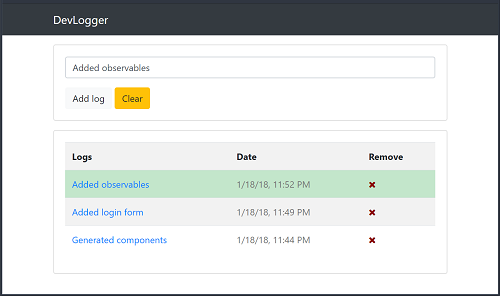

# Angular DevLogger App using localStorage
This project is the result of my code-along to the DevLogger App Project in [Angular Front to Back](https://www.udemy.com/angular-4-front-to-back/) by *Brad Traversy*.  He is an excellent teacher, and I highly recommend taking his course to learn Angular! 

The **BEST** part of this project is that he explains **how to use RxJS to transfer data between sibling components**.  Additional information about this technique is detailed below:

<p align="center">
    <br>
</p>

## Versions
* [Angular CLI](https://github.com/angular/angular-cli) v1.6.4
* Angular v5.2.1
* Bootstrap v4.0.0

## Installation
1. Clone this repo `git clone https://github.com/Stanza987/angular-localStorage-devlogger.git`
1. `cd` into the folder of the cloned repo
1. Run `yarn install` to install dependencies
1. Run `ng serve`, and navigate to `http://localhost:4200/`

# RxJS - BehaviorSubject
BehaviorSubject is a type of RxJS **Subject** that acts as both an *Observer* and an *Observable*.  We can use BehaviorSubject to store initial data, which can then be updated and read throughout the application.  This can be done synchronously through `.getValue()` or asynchronously through `.subscribe()`.  This app uses the latter method to share data across components.

Consider the following static data set in `log.service.ts`
```typescript
constructor() {
  this.logs = [
    { id: '1', text: 'Generated components', date: new Date('12/26/2017 12:54:23') },
    { id: '2', text: 'Added Bootstrap', date: new Date('12/27/2017 9:33:13') },
    { id: '3', text: 'Added logs component', date: new Date('12/27/2017 12:00:23') }
  ];
}
```

## Synchronous Data Sharing

In order for the component to access the data defined in the service, the component must call the `getLogs()` method in `log.service.ts`
```typescript
// log.service.ts
getLogs() {
  return this.logs;
}
```

```typescript
// logs.component.ts
logs: Log[];

ngOnInit() {
  this.logs = this.logService.getLogs();
}
```

Although this is nice, if the data were to be updated, we can't share this new data asynchronously with another component.  That's where BehaviorSubject can be useful!

## Using BehaviorSubject
1. Import BehaviorSubject into `log.service.ts`
    ```typescript
    import { BehaviorSubject } from 'rxjs/BehaviorSubject';
    ```

1. Create a new BehaviorSubject with an initial value
    ```typescript
    logSource = new BehaviorSubject<Log>({id: null, text: null, date: null});
    ```

1. Update the value of an existing BehaviorSubject by calling the `next` method with a new value.  In the project, this is done in the method `setFormLog(log)`
    ```typescript
    setFormLog(log: Log) {
      this.logSource.next(log);
    }
    ```

1. Update the `getLogs()` method to return an *Observable* by using the `of` operator, which converts arguments into an observable sequence.  Now, `getLogs` will report data asynchronously
    ```typescript
    import { of } from 'rxjs/observable/of';
    ...

    getLogs(): Observable<Log[]> {
      return of(this.logs);
    }
    ```

## Asynchronous Data Sharing
1. Populate data asynchronously into `logs.component.ts` through `logService`
    ```typescript
    ngOnInit() {
      this.logService.getLogs().subscribe(logs => this.logs = logs);
    }
    ```

1. Read this same data asynchronously in `log-form.component.ts` through `logService`
    ```typescript
    ngOnInit() {
      this.logservice.logSource.subscribe(log => {
        if (log.id !== null) {
          this.id = log.id;
          this.text = log.text;
          this.date = log.date;
        }
      });
    }
    ```

## Transfer data between two sibling components
Data shared from `logs.component` to `log-form.component` through a `click` event

```html
<!-- logs.component.html -->
<td><a href="#" (click)="onSelect(log)">{{ log.text }}</a></td>
```

```typescript
// logs.component.ts
onSelect(log: Log) {
  this.logService.setFormLog(log);
}
```

```html
<!-- log-form.component.html -->
<input type="text" name="text" [(ngModel)]="text" class="form-control" placeholder="Add a log...">
```

## References
* [Thinkster.io - Subjects, Observers, Observables, and Operators](https://thinkster.io/tutorials/learn-rxjs-observables/subjects-observables-and-operators)
* [Thinkster.io - Using BehaviorSubject for Values That Change over Time](https://thinkster.io/tutorials/learn-rxjs-observables/using-behaviorsubject-for-values-that-change-over-time)
* [RxJS 'of' operator](https://github.com/Reactive-Extensions/RxJS/blob/master/doc/api/core/operators/of.md)